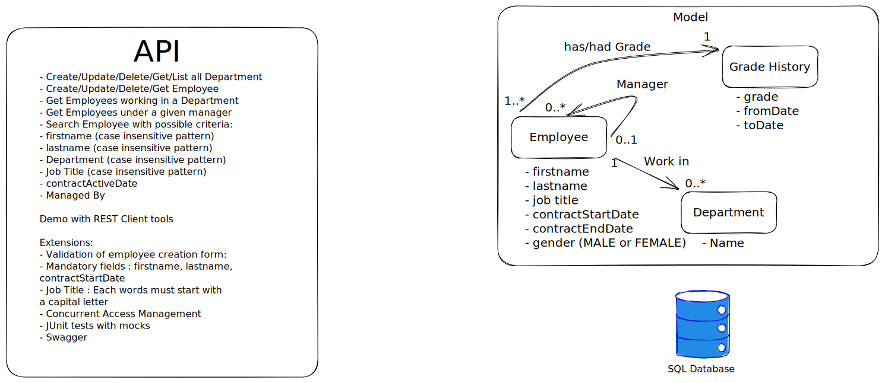

# Technical Test

## Structure du modèle de données

### Employee
- Un employé peut avoir un manager (qui est lui-même un employé)
- Un manager peut avoir plusieurs subordonnés (employés)
- Un employé appartient à un département

### Department
- Un département peut contenir plusieurs employés

## Structure du modèle de données

### Employee
- Un employé peut avoir un manager (qui est lui-même un employé)
- Un manager peut avoir plusieurs subordonnés (employés)
- Un employé appartient à un département

### Department
- Un département peut contenir plusieurs employés

## Architecture des DTOs

### EmployeeDto
- Représentation complète d'un employé avec ses relations
- Utilise EmployeeBasicDto pour éviter les références circulaires

### EmployeeBasicDto
- Version simplifiée contenant uniquement l'ID et le nom
- Utilisé pour représenter les managers et subordonnés

### EmployeeCreationDto
- Utilisé pour la création d'un nouvel employé
- Contient des validations pour assurer l'intégrité des données

### DepartmentDto
- Représentation simple d'un département

## Mappers

Les mappers MapStruct permettent une conversion transparente entre les entités et les DTOs.

## Structure du modèle de données

### Employee
- Un employé peut avoir un manager (qui est lui-même un employé)
- Un manager peut avoir plusieurs subordonnés (employés)
- Un employé appartient à un département

### Department
- Un département peut contenir plusieurs employés

## API REST

### Endpoints pour les départements

- `GET /api/departments` - Récupérer tous les départements
- `GET /api/departments/{id}` - Récupérer un département par ID
- `POST /api/departments` - Créer un nouveau département
- `PUT /api/departments/{id}` - Mettre à jour un département existant
- `DELETE /api/departments/{id}` - Supprimer un département

### Endpoints pour les employés

- `GET /api/employees` - Récupérer tous les employés
- `GET /api/employees/{id}` - Récupérer un employé par ID
- `GET /api/employees/by-manager/{managerId}` - Récupérer les employés par manager
- `GET /api/employees/by-department/{departmentId}` - Récupérer les employés par département
- `GET /api/employees/top-level` - Récupérer les employés sans manager
- `POST /api/employees` - Créer un nouvel employé
- `PUT /api/employees/{id}` - Mettre à jour un employé existant
- `DELETE /api/employees/{id}` - Supprimer un employé

## API REST

### Endpoints pour les départements

- `GET /api/departments` - Récupérer tous les départements
- `GET /api/departments/{id}` - Récupérer un département par ID
- `POST /api/departments` - Créer un nouveau département
- `PUT /api/departments/{id}` - Mettre à jour un département existant
- `DELETE /api/departments/{id}` - Supprimer un département

### Endpoints pour les employés

- `GET /api/employees` - Récupérer tous les employés
- `GET /api/employees/{id}` - Récupérer un employé par ID
- `GET /api/employees/by-manager/{managerId}` - Récupérer les employés par manager
- `GET /api/employees/by-department/{departmentId}` - Récupérer les employés par département
- `GET /api/employees/top-level` - Récupérer les employés sans manager
- `POST /api/employees` - Créer un nouvel employé
- `PUT /api/employees/{id}` - Mettre à jour un employé existant
- `DELETE /api/employees/{id}` - Supprimer un employé

## Architecture des DTOs

### EmployeeDto
- Représentation complète d'un employé avec ses relations
- Utilise EmployeeBasicDto pour éviter les références circulaires

### EmployeeBasicDto
- Version simplifiée contenant uniquement l'ID et le nom
- Utilisé pour représenter les managers et subordonnés

### EmployeeCreationDto
- Utilisé pour la création d'un nouvel employé
- Contient des validations pour assurer l'intégrité des données

### DepartmentDto
- Représentation simple d'un département

## Mappers

Les mappers MapStruct permettent une conversion transparente entre les entités et les DTOs.
