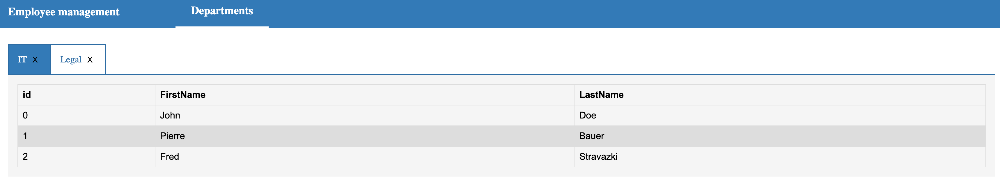
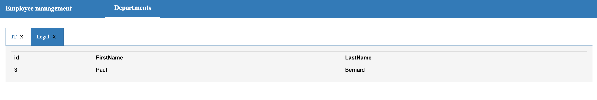
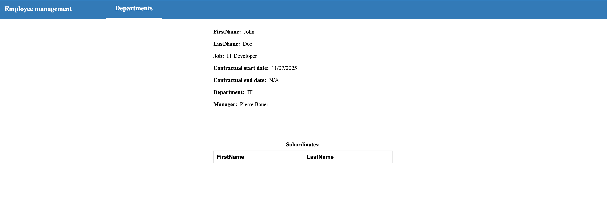

# Frontend

You have an application that already implement:

- The default routing
- A Header
- An empty departments component

You will have to:

1. Get the departments and the employee of each of them (Backend API GET - /api/departments). Display them in the Departments component in the way you want
2. Create a reusable Tab component and use it in your departments component as follow:
   
   
3. Add a button to consult the detail of each employee (Backend API GET - /api/employees/{id}). By clicking on the button you should navigate to /employees/{id} and display the details component that should look like this:
   
